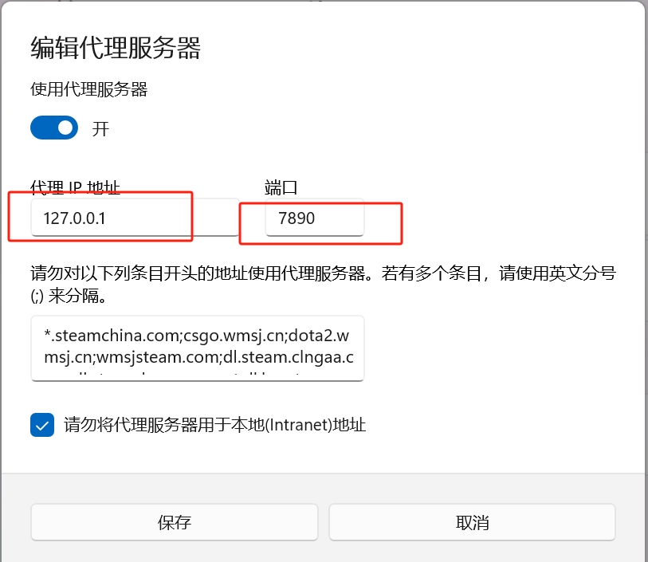

#### git再推送代码的时候经常会遇到超时或者无法推送等问题本编文章主要解决Failed to connect to github.com port 443 after 21090 ms: Couldn‘t connect to server的问题
#### 问题原因：这是由于本机系统代理端口和git端口不一致导致的。
#### 解决办法：
##### 1.查看自己本机系统代理
```ts
设置---网络和Internet---代理---地址---端口
```


##### 2.修改git配置：（其中的7890改为你电脑的端口号）
```shell
git config --global http.proxy http://127.0.0.1:7890
git config --global https.proxy http://127.0.0.1:7890
```
##### 3.再次push就可以成功上传。
```shell
git push origin source
```
