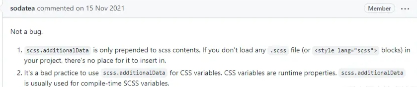

### 在vite项目中，有时候我们需要全局引入css变量、scss变量，或者引入全局scss样式文件，vite提供了以下这种配置方式
```ts
//vite.config.js
css: {
  preprocessorOptions: {
    //define global scss variable
    scss: {
      additionalData: `@import '@/styles/variables.scss';`,
    }
  }
}
```
##### 这种写法没有任何问题，并且我已经在一些项目中实践过了，可有一次我创建新项目的时候却无效了，在浏览器上也没有看到任何相关的样式，但是在main.js中引入又是正常的,后来去插件官方论坛找到了解决方法是这样说的。

##### 原来这不是一个bug，只有在main.js引入一个其他scss文件或者在.vue文件中使用 style，并且里面有内容，则 scss.additionalData 配置的全局scss文件就可以正确引入了，还建议我们在 scss.additionalData 引入的文件最好只写scss变量，别写css变量，因为css变量是运行时属性,至此，这个问题算是圆满解决了